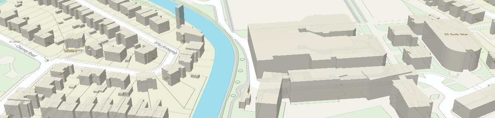
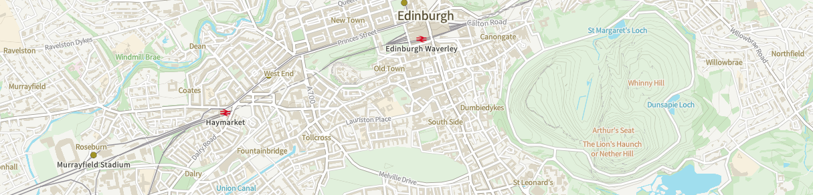
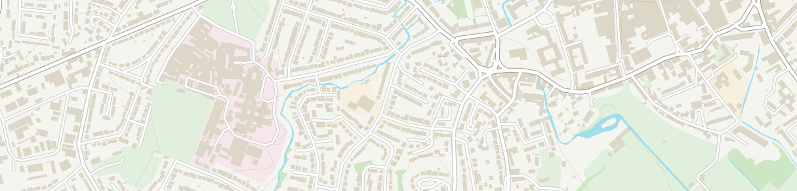
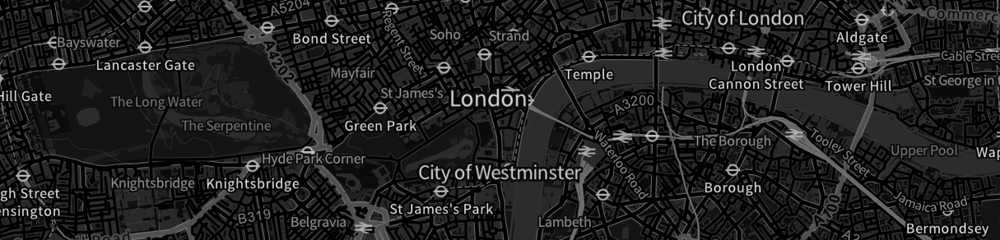
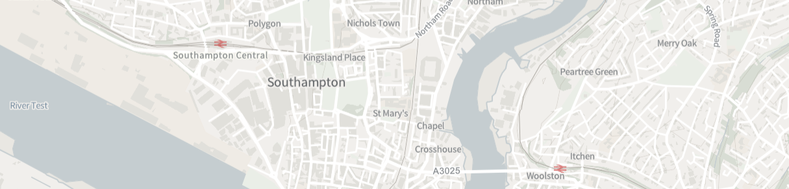
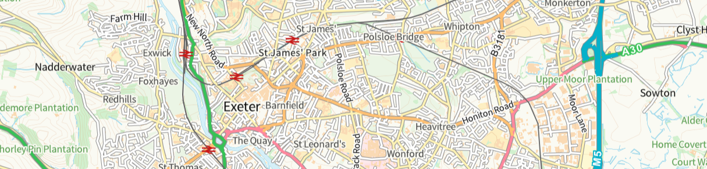
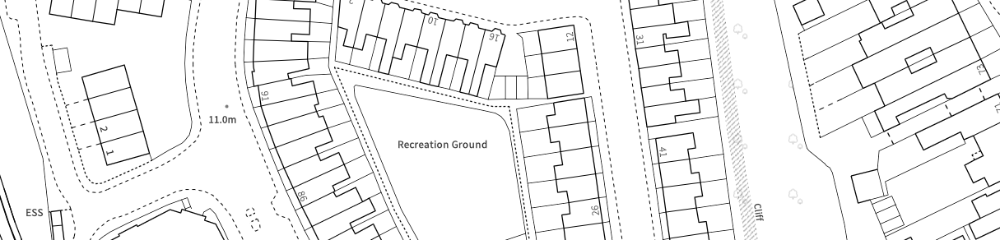

# OS Vector Tile API Stylesheets

Cartographic stylesheets for use with [OS Vector Tile API](https://osdatahub.os.uk/docs/vts/overview) which is available from the [OS Data Hub](https://osdatahub.os.uk/).

As OS Vector Tile API is available in two projections, EPSG:27700 and EPSG:3857, which have different zoom levels, we provide a seperate stylesheet for both.

## Getting started

This [code example](https://labs.os.uk/public/os-data-hub-examples/os-vector-tile-api/vts-example-custom-style) will help you integrate these stylesheets into your application with options for various web mapping libraries.

## Using the styles in QGIS

If you are intending on using the Vector Tiles API in QGIS (only available in EPSG: 3857), we recommend following the instructions in our [Getting started guide](https://docs.os.uk/os-apis/accessing-os-apis/os-vector-tile-api/getting-started/qgis) and then using the QGIS style files in this GitHub Repo to ensure text renders correctly. 

## Styles

### 3D buildings

Use this style to add 3D building extrusions to your map.

This style uses the building height attributes (RelHMax) on OS MasterMap Topography Layer buildings to show the maximum height of each building footprint.

`OS_VTS_3857_3D.json` and `OS_VTS_27700_3D.json`

### ArcGIS API for JavaScript

Use this version of the Outdoor style with [ArcGIS API for JavaScript](https://developers.arcgis.com/javascript/).

Our labelling rules for OS MasterMap Topography Layer Cartographic Text use some elements of the [Mapbox Style Specification](https://docs.mapbox.com/mapbox-gl-js/style-spec/) that aren't supported by ESRI. These styles have been designed to be fully compatible with ArcGIS API for JavaScript.

`OS_VTS_3857_ESRI.json` and `OS_VTS_27700_ESRI.json`

### No labels

A stripped back map for when topography alone is all you need.

`OS_VTS_3857_No_Labels.json` and `OS_VTS_27700_No_Labels.json`

### Outdoor (OS OpenData)

Outdoor style for OS OpenData.

NOTE: Only works with the OS OpenData but allows overzoom.

`OS_VTS_3857_Open_Outdoor.json` and `OS_VTS_27700_Open_Outdoor.json`

### Greyscale

A simple greyscale style.

`OS_VTS_3857_Greyscale.json` and `OS_VTS_27700_Greyscale.json`

(OS OpenData with overzoom => `OS_VTS_3857_Open_Greyscale.json` and `OS_VTS_27700_Open_Greyscale.json`)

### Dark

A simple dark (inverted greyscale) style.

Thanks to [Mike Brondbjerg](https://twitter.com/mikebrondbjerg/status/1353765133558943745) for the inspiration.

`OS_VTS_3857_Dark.json` and `OS_VTS_27700_Dark.json`

(OS OpenData with overzoom => `OS_VTS_3857_Open_Dark.json` and `OS_VTS_27700_Open_Dark.json`)

### Light

The OS Light style, perfect for backdrop mapping.

`OS_VTS_3857_Light.json` and `OS_VTS_27700_Light.json`

(OS OpenData with overzoom => `OS_VTS_3857_Open_Light.json` and `OS_VTS_27700_Open_Light.json`)

### Road

The OS Road style, a familiar style with a particular focus on the GB transport network.

`OS_VTS_3857_Road.json` and `OS_VTS_27700_Road.json`

(OS OpenData with overzoom => `OS_VTS_3857_Open_Road.json` and `OS_VTS_27700_Open_Road.json`)

### Black and White

A simple black and white style.

`OS_VTS_3857_Black_and_White.json` and `OS_VTS_27700_Black_and_White.json`

(OS OpenData with overzoom => `OS_VTS_3857_Open_Black_and_White.json` and `OS_VTS_27700_Open_Black_and_White.json`)

## Licence

The contents of this repository are licensed under the [Open Government Licence 3.0](https://www.nationalarchives.gov.uk/doc/open-government-licence/version/3/).

